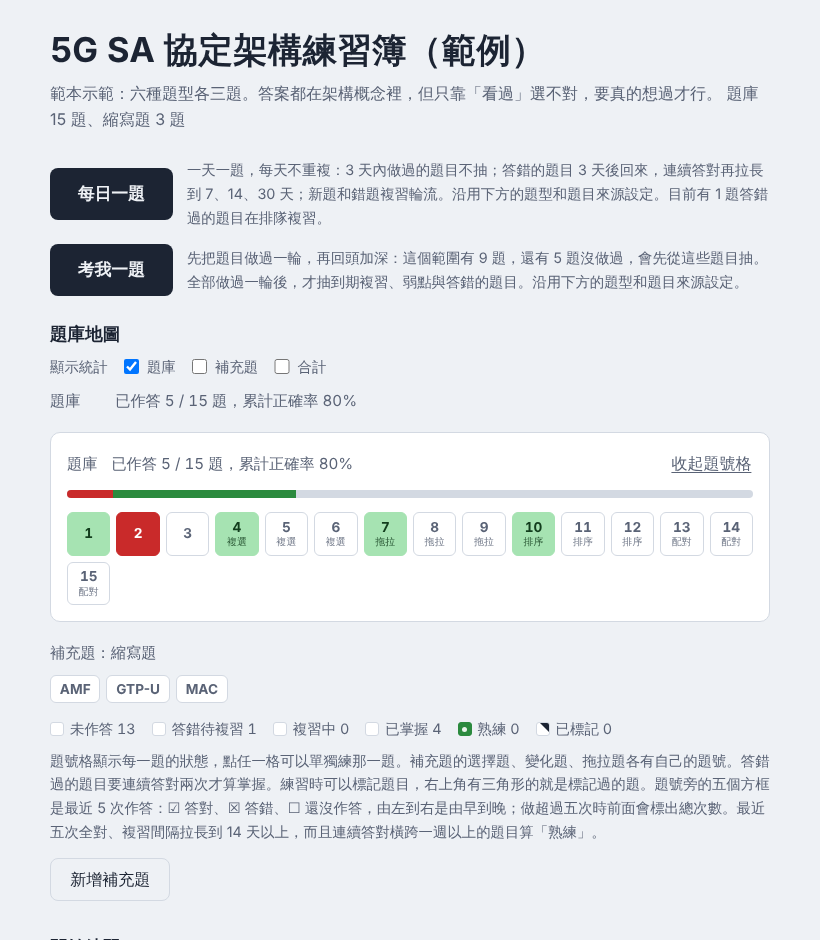

# 模擬考練習簿（Mock-Exam）

把題目寫成一份 JSON，就能產生一個可以直接用瀏覽器開啟的練習簿：單一 HTML 檔，不需要伺服器，也不需要安裝任何東西就能作答。

練習簿 = 固定的引擎（`assets/template.html`）+ 你的題庫（`bank.json`）。你只需要寫題庫，作答、判分、複習排程、模擬考和列印都由引擎處理。



## 先看成品

下載 `assets/template.html`，用瀏覽器打開。它內含一份 15 題的範例題庫，六種題型各三題，可以直接試用。

## 需要什麼

- **作答的人**：只要瀏覽器。
- **出題的人**：Python 3，用來執行 `scripts/build.py`，只用到標準函式庫。要讓它自動壓縮題目附圖的話再安裝 Pillow（`pip install pillow`），沒裝也能用。

下面的指令在 Windows 上請把 `python3` 換成 `python`。

## 做一份自己的練習簿

### 1. 取得這個 repo

```bash
git clone -b main https://github.com/HelloNiHowMa/Mock-Exam.git
cd Mock-Exam
```

`main` 是穩定版；`dev` 是開發中的版本，也是這個 repo 的預設分支。

### 2. 寫題庫

建一個資料夾放題庫，例如 `my-workbook/bank.json`：

```json
{
  "config": {
    "id": "my-first-workbook",
    "title": "我的第一份練習簿",
    "subtitle": "示範用的兩題。"
  },
  "questions": [
    {"n": 1,
     "q": "瀏覽器送出請求後收到狀態碼 404，代表什麼？",
     "o": ["伺服器內部發生錯誤", "找不到請求的資源", "請求成功", "需要先登入"],
     "a": 1,
     "e": "404 Not Found 表示伺服器找不到這個網址對應的資源。\n容易卡住的地方：把 404 和 500 搞混。4 開頭是請求這一端的問題，5 開頭才是伺服器出錯。"},
    {"n": 2, "type": "order",
     "q": "把瀏覽器開啟一個 HTTPS 網頁的步驟排成正確順序。",
     "items": ["DNS 查詢網域的 IP", "建立 TCP 連線", "TLS 交握", "送出 HTTP 請求"],
     "e": "先知道對方在哪裡才能連線；連線建立後才做加密交握，最後才送出請求。\n容易卡住的地方：以為 TLS 交握在 TCP 連線之前。TLS 是跑在 TCP 上面的。"}
  ]
}
```

想從完整的例子開始改，可以把範例題庫取出來：

```bash
python3 scripts/build.py --extract assets/template.html --dump example
```

會得到 `example/bank.json` 和 `example/images.json`。

### 3. 檢查格式

```bash
python3 scripts/build.py --bank my-workbook/bank.json --check
```

- **錯誤**：格式不符，一定要修，否則不會產生檔案。
- **提醒**：格式沒問題，但可能影響出題品質，例如正確答案老是放在同一個位置。逐條判斷要不要改。

### 4. 產生練習簿

```bash
python3 scripts/build.py --bank my-workbook/bank.json --out my-workbook/練習簿.html
```

用瀏覽器打開 `my-workbook/練習簿.html` 就能作答。這個檔案可以直接傳給別人，或放到內部網站。

## 題庫怎麼寫

完整格式在 [`references/schema.md`](references/schema.md)，這裡只列重點。

| 區塊 | 內容 |
|---|---|
| `config` | 練習簿的設定。`id` 和 `title` 必填，其餘有預設值。 |
| `questions` | 題目。五種題型：單選 `mcq`（可省略 `type`）、複選 `multi`、分類 `cls`、排序 `order`、配對 `match`。 |
| `abbr` | 縮寫題：看到縮寫，寫出英文全名。可以不寫。 |
| `groups` | 易混淆題組：把容易搞混的題目綁在一起連續出題。可以不寫。 |

最容易出錯的幾件事：

- **答案位置從 0 開始**：`"a": 1` 是第二個選項。
- **選項照正確答案的順序寫就好**：選項、排序項目和配對右欄，作答時都會自動打亂。
- **題號 `n` 不能重複**：1 到 999 是題庫；1001 到 9998 是補充題，會另外排在補充題區；1000 不能用。
- **`config.id` 和題號發佈後不要改**：作答紀錄綁在這兩個值上，改了紀錄就接不回來。刪題就讓號碼空著，新題接在最大號後面。
- **不要用 Markdown 語法**：頁面會原樣顯示。解析要分段請用 `\n`。

### 加圖片

把圖片放在一個資料夾，檔名去掉副檔名就是代號，題目用 `img`（題目附圖）或 `eimg`（作答後才顯示的解析附圖）引用：

```json
{"n": 3, "q": "圖中標示問號的介面是？", "img": ["topo1"], "o": ["F1-C", "E1", "N2", "Xn-C"], "a": 0, "e": "……"}
```

```bash
python3 scripts/build.py --bank my-workbook/bank.json --images my-workbook/images --out my-workbook/練習簿.html
```

圖片會內嵌進 HTML，仍然是單一檔案。

## 修改已經發出去的練習簿

手上只有 HTML 也沒關係，先把題庫取出來，改完再重新產生：

```bash
python3 scripts/build.py --extract 舊練習簿.html --dump old
# 修改 old/bank.json
python3 scripts/build.py --bank old/bank.json --images-json old/images.json --out 新練習簿.html
```

同樣的步驟也能把舊練習簿升級到新版引擎：取出題庫，用新的範本重新產生。只要 `config.id` 和題號沒變，而且新檔案放在原本的位置（同一個網址，或更新同一個 artifact），原本的作答紀錄會接續下去。

## 練習簿怎麼用（給作答的人）

主頁由上到下：

- **每日一題**：一天一題，每天不重複，新題和錯題複習輪流出。
- **考我一題**：隨機抽一題。先把還沒做過的題目抽完一輪，之後才抽到期複習、弱點和答錯的題目。
- **題庫地圖**：每個題號格的顏色代表狀態（未作答、答錯待複習、複習中、已掌握、熟練），點任一格可以單獨練那一題。
- **開始練習**：自己設定一回練習。
  - 模式：「練習」每題作答後立刻看解析；「模擬考」交卷後才看答案。
  - 出題範圍：全部題目、錯題複習、弱點題、到期複習、易混淆題組、還沒做過、已標記。
  - 作答方式：「先回想再看選項」會先藏起選項，想好再顯示；也可以選「直接看選項」。
  - 計時：不計時、正計時、倒計時。
- **考前快速瀏覽**、**列印**：把目前範圍的題目快速看過一遍，或印成紙本。
- **新增補充題**：在頁面上加自己的題目，只存在自己的紀錄裡。

作答時：

- 選項右邊的 **×** 標記「不是答案」，**○** 標記「可能是答案」。兩者都只是作答當下的記號，不影響紀錄；作答後如果刪掉了正解，或把正解標成可能卻沒選，頁面會提醒。
- 鍵盤：數字或字母作答，Shift + 數字刪去選項，Shift + 字母標為可能，M 標記這一題。
- 答錯過的題目要連續答對兩次才算掌握，之後複習間隔會逐步拉長。

### 作答紀錄存在哪裡

紀錄存在這台裝置的瀏覽器裡，不會傳到任何地方。換瀏覽器、換裝置，或清除瀏覽器資料，紀錄就不在了；主頁最下方的「清除所有進度」可以手動歸零。

練習簿發佈成 Claude artifact 時，紀錄會改成跟著帳號同步，題目解析旁也會多一個「AI 解析」按鈕。放在其他地方時這兩項自動隱藏，不影響作答。

## 檔案說明

| 路徑 | 內容 |
|---|---|
| `assets/template.html` | 範本引擎，內含範例題庫。不需要修改，題庫由 `build.py` 放進去。 |
| `scripts/build.py` | 檢查題庫、產生練習簿、從現有練習簿取出題庫。 |
| `references/schema.md` | 題庫格式的完整說明。 |
| `known-issues.md` | 已知問題和避法。 |

## 注意事項

- 要分享給別人的練習簿，不要放考古題、原廠題庫或商業題庫的原文。
- 已知問題和避法寫在 [`known-issues.md`](known-issues.md)。
